<!-- Generated by scripts/build.mjs — edit profile.config.json instead. -->

<picture><source media="(prefers-color-scheme: dark)" srcset="assets/hero-dark.svg"><source media="(prefers-color-scheme: light)" srcset="assets/hero-light.svg"></picture>

<a href="mailto:hthinhaien@gmail.com"><b>Email</b></a> &nbsp;·&nbsp; <a href="https://www.facebook.com/profile.php?id=100082113433852"><b>Facebook</b></a> &nbsp;·&nbsp; <a href="https://github.com/ThinhHoang1?tab=repositories"><b>Repositories</b></a>

> I build AI agents that do real work: they hold conversations, call tools, read images, remember context and hand off to a human when they should. Then I test them the way a real user would. Most of that code is private; every number on this page comes from real data and is drawn by code in this repo.

<picture><source media="(prefers-color-scheme: dark)" srcset="assets/core-dark.svg"><source media="(prefers-color-scheme: light)" srcset="assets/core-light.svg"></picture>

<picture><source media="(prefers-color-scheme: dark)" srcset="assets/skyline-dark.svg"><source media="(prefers-color-scheme: light)" srcset="assets/skyline-light.svg"></picture>

### 03 // Selected work

<picture><source media="(prefers-color-scheme: dark)" srcset="assets/card-private-dark.svg"><source media="(prefers-color-scheme: light)" srcset="assets/card-private-light.svg"></picture>
<a href="https://github.com/ThinhHoang1/video-studio"><picture><source media="(prefers-color-scheme: dark)" srcset="assets/card-video-studio-dark.svg"><source media="(prefers-color-scheme: light)" srcset="assets/card-video-studio-light.svg"></picture></a>
<a href="https://github.com/ThinhHoang1/hr-cv-matcher"><picture><source media="(prefers-color-scheme: dark)" srcset="assets/card-hr-cv-matcher-dark.svg"><source media="(prefers-color-scheme: light)" srcset="assets/card-hr-cv-matcher-light.svg"></picture></a>
<a href="https://github.com/ThinhHoang1/Coffee_leaf_disease"><picture><source media="(prefers-color-scheme: dark)" srcset="assets/card-coffee-leaf-dark.svg"><source media="(prefers-color-scheme: light)" srcset="assets/card-coffee-leaf-light.svg"></picture></a>
<a href="https://github.com/ThinhHoang1/News-Sentiment-Analysis-Application"><picture><source media="(prefers-color-scheme: dark)" srcset="assets/card-news-sentiment-dark.svg"><source media="(prefers-color-scheme: light)" srcset="assets/card-news-sentiment-light.svg"></picture></a>
<a href="https://ai-english-speaking-practice.vercel.app/"><picture><source media="(prefers-color-scheme: dark)" srcset="assets/card-speaking-coach-dark.svg"><source media="(prefers-color-scheme: light)" srcset="assets/card-speaking-coach-light.svg"></picture></a>
<a href="https://github.com/ThinhHoang1/Customer-Semantic-Search-with-Google-AI-MongoDB-Atlas"><picture><source media="(prefers-color-scheme: dark)" srcset="assets/card-semantic-search-dark.svg"><source media="(prefers-color-scheme: light)" srcset="assets/card-semantic-search-light.svg"></picture></a>
<a href="https://github.com/ThinhHoang1/IELTS-Writing-Grader-API_Vietnamese_version"><picture><source media="(prefers-color-scheme: dark)" srcset="assets/card-ielts-grader-dark.svg"><source media="(prefers-color-scheme: light)" srcset="assets/card-ielts-grader-light.svg"></picture></a>

<picture><source media="(prefers-color-scheme: dark)" srcset="assets/arsenal-dark.svg"><source media="(prefers-color-scheme: light)" srcset="assets/arsenal-light.svg"></picture>

No third-party widgets. A zero-dependency Node script in this repo draws every image above, and a GitHub Action redraws them every night.

