<!-- Generated by scripts/build.mjs — edit profile.config.json instead. -->

<picture><source media="(prefers-color-scheme: dark)" srcset="assets/hero-dark.svg"><source media="(prefers-color-scheme: light)" srcset="assets/hero-light.svg"></picture>

<a href="https://www.linkedin.com/in/thinhhh/"><b>LinkedIn</b></a> &nbsp;·&nbsp; <a href="mailto:hthinhaien@gmail.com"><b>hthinhaien@gmail.com</b></a> &nbsp;·&nbsp; <a href="https://www.facebook.com/profile.php?id=100082113433852"><b>Facebook</b></a>

> I build AI agents that work in production: sales agents that answer customers on Messenger, Zalo and Facebook Page comments, recognize products from customer photos, take orders in Vietnamese and know when to hand off to a human. Around them I build the platform pieces: OpenClaw plugins and skills, schema-driven dashboards, webhook services that survive multiple replicas, and E2E suites that test like a real user. That code is private, so this page shows what it taught me instead. Every number here comes from real data.

<picture><source media="(prefers-color-scheme: dark)" srcset="assets/core-dark.svg"><source media="(prefers-color-scheme: light)" srcset="assets/core-light.svg"></picture>

<picture><source media="(prefers-color-scheme: dark)" srcset="assets/skyline-dark.svg"><source media="(prefers-color-scheme: light)" srcset="assets/skyline-light.svg"></picture>

<picture><source media="(prefers-color-scheme: dark)" srcset="assets/notes-dark.svg"><source media="(prefers-color-scheme: light)" srcset="assets/notes-light.svg"></picture>

### 04 // Selected work

<b>Bàn tay mười nghìn</b> <i>(The ten-thousand-đồng hand)</i>: a hand-drawn short film, made entirely in code 
<a href="https://github.com/ThinhHoang1/code-animated-film/releases/download/v1.0/ban-tay-muoi-nghin.mp4"><b>▶ Watch the full film (1080p, 11:47)</b></a> &nbsp;·&nbsp; <a href="https://github.com/ThinhHoang1/code-animated-film"><b>Source code</b></a> 
11:47 · original story · 109 lines in 11 chapters · 5 character voices · ~20 hand-drawn sets · 1080p30 
Script → Gemini TTS, 3 takes per line → Whisper large-v3-turbo keeps the take that matches the script → mouth envelopes and cue timing → every frame redrawn by a canvas ink rig → HyperFrames render. No drawing app, no timeline.

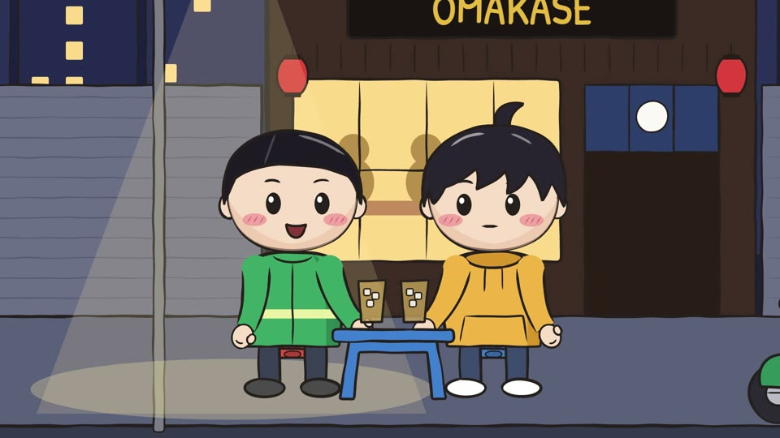

<picture><source media="(prefers-color-scheme: dark)" srcset="assets/card-private-dark.svg"><source media="(prefers-color-scheme: light)" srcset="assets/card-private-light.svg"></picture>
<picture><source media="(prefers-color-scheme: dark)" srcset="assets/card-platform-dark.svg"><source media="(prefers-color-scheme: light)" srcset="assets/card-platform-light.svg"></picture>
<a href="https://github.com/ThinhHoang1/claude-code-agent-team"><picture><source media="(prefers-color-scheme: dark)" srcset="assets/card-agent-team-dark.svg"><source media="(prefers-color-scheme: light)" srcset="assets/card-agent-team-light.svg"></picture></a>
<a href="https://github.com/ThinhHoang1/video-studio"><picture><source media="(prefers-color-scheme: dark)" srcset="assets/card-video-studio-dark.svg"><source media="(prefers-color-scheme: light)" srcset="assets/card-video-studio-light.svg"></picture></a>
<a href="https://github.com/ThinhHoang1/Coffee_leaf_disease"><picture><source media="(prefers-color-scheme: dark)" srcset="assets/card-coffee-leaf-dark.svg"><source media="(prefers-color-scheme: light)" srcset="assets/card-coffee-leaf-light.svg"></picture></a>

<picture><source media="(prefers-color-scheme: dark)" srcset="assets/arsenal-dark.svg"><source media="(prefers-color-scheme: light)" srcset="assets/arsenal-light.svg"></picture>

No third-party widgets. A zero-dependency Node script in this repo draws every image above, and a GitHub Action redraws them every night.

